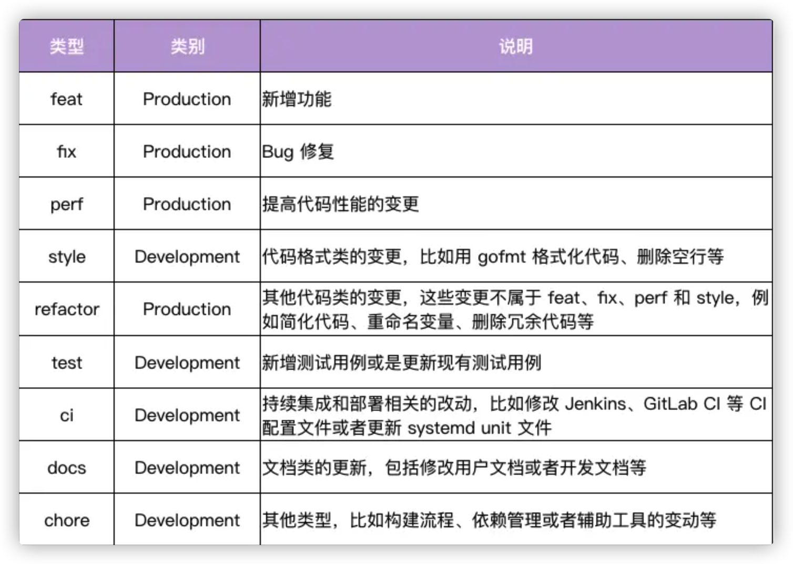

# Django_prac
> 项目简介：
> 
> 1. polls 应用是根据 Django 官方文档创建的应用
>
> 2. snippets 应用是根据 drf 官方文档创建的应用
> 
> 单元测试框架： pytest
## 项目启动
```shell
# 创建环境
python -m venv venv

# 安装依赖
pip install -r requirements.txt

# django 会检测模型文件的修改，将修改的部分存储为一次迁移。执行下面的指令可以选中还没有执行过的迁移
# 并应用到数据库上

python manage.py makemigrations polls

# 检查 INSTALLED_APPS 为其中的应用创建需要的数据表
python manage.py migrate

# 管理静态文件
python manage.py collectstatic

# 启动项目
python manage.py runserver

# 其他
# 查看 Django 版本
python -m django --version

# 运行单元测试
# 这种可以在 pycharm 中的 terminal 使用的时候可以用得到
python -m pytest 
# 或者
pytest

# 查看 Python 各种指令参数
python -h

```
## 项目目录
```shell
  manage.py # 一个让你用各种方式管理 Django 项目的命令行工具
  mysite/
      __init__.py # 一个空文件，告诉 Python 这个目录应该被认为是一个 Python 包
      settings.py # Django 项目的配置文件
      urls.py # Django 项目的 URL 声明，就像你网站的“目录”，可以理解成路由目录
      asgi.py # 
      wsgi.py
  apps/ # 跟具体业务相关的应用们
      polls # 根据 Django 官方文档写的一个投票应用
      snippets # 根据 drf 官方文档写的一个拥有用户权限的应用
  .flake8 # flake8 配置文件，用于规范 Python 代码格式，直接运行 `flake8` 会显示哪些文件需要修改
```
### 项目中的 packages
```shell
pip list --format=freeze > requirements.txt
```

> tips
> 原本项目放在 mysite 下，进行了如下调整
> `mv mysite test` 将 mysite 文件夹重命名为 test
> `mv test ./` 将 test 目录下的所有内容移动到当前根目录下
> `rm test/`  删除 test 文件夹
## MTV 设计模式
[关于 MTV 模式](https://blog.csdn.net/dbanote/article/details/11338953)

M: Model 负责业务对象和数据库的关系映射([ORM](https://zhuanlan.zhihu.com/p/27188788)，对象关系映射，
直白来说就是我在程序中定义一个对象就对应一个表，这个对象的一个实例即对应表中的一条记录)。

T: Template 负责如何把页面展示给用户

V: View 负责业务逻辑，视图函数的执行结果只可能有两种，返回一个可以是任何内容的 HttpResponse 对象，另一个就是 Http404 这类的异常。

### 开发流程
> 开发流程主要就是生成、改变模型，主要需要这三步：

- 编辑 models.py 文件，改变模型。
- 运行 python manage.py makemigrations xx 为模型的改变生成迁移文件。（通过运行 makemigrations 命令，Django 会检测你对模型文件的修改（在这种情况下，你已经取得了新的），并且把修改的部分储存为一次 迁移。）
- 运行 python manage.py migrate 来应用数据库迁移。
- 修改 views 视图
- python manage.py runserver

数据库迁移被分解成生成和应用两个命令是为了让你能够在代码控制系统上提交迁移数据并使其能在多个应用里使用； 
这不仅仅会让开发更加简单，也给别的开发者和生产环境中的使用带来方便。

### 删除数据表
```shell
python manage.py dbshell

drop table dbshell

python manage.py makemigrations snippets
# https://docs.djangoproject.com/zh-hans/4.0/ref/django-admin/#cmdoption-migrate-fake
python manage.py migrate --fake snippets zero

# 再执行一次
python manage.py migrate

```
### superuser 
1. admin 123456 
2. user1 123456
3. user2 123456
4. user3 123456

## 代码提交规范


## Q&A
1. on_delete=models.CASCADE 什么意思
~~2. 如何返回 json 类型数据，而不是字符串~~
进行序列化，我们使用 djangorestframework 中的序列化正是解决了这个问题。

同时我们利用 djangorestframework 也实现了简单的 basic auth 将更新数据和用户相关联，

即只有 admin 用户能够「更新」与之对应的代码段

## TODO
- 使用 django filter